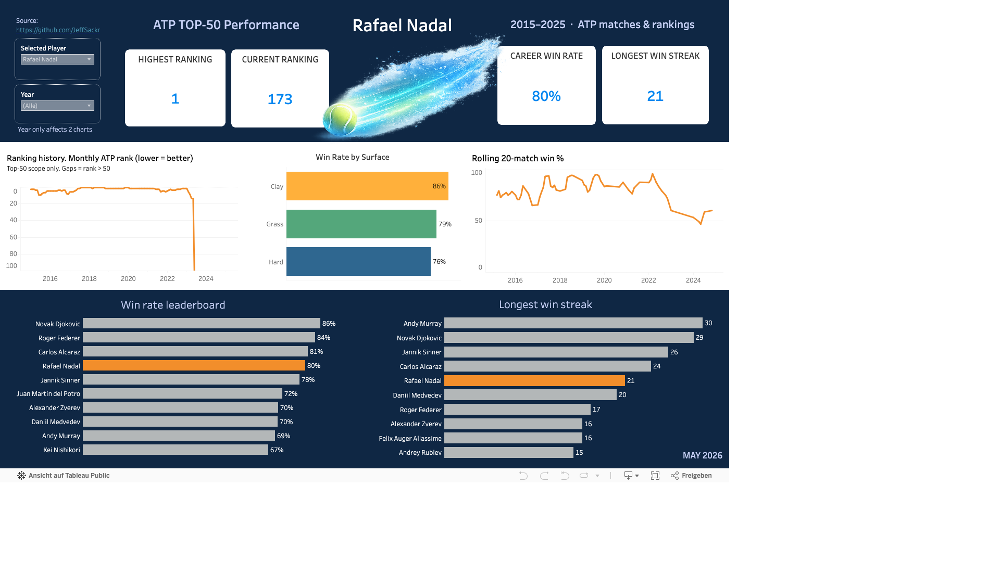

# ATP Top-50 Analytics (2015–2025)

End-to-end analytics project on male ATP players who reached the **Top 50** at least once between 2015 and 2025. Raw CSVs are loaded with Python, transformed in **SQLite/SQL**, and visualized in **Tableau**.

**Live dashboard:** [Tableau Public](https://public.tableau.com/app/profile/katja.blau/viz/ATP_17804953556700/Dashboard)



## What this demonstrates

- **ETL:** pandas loads public ATP CSVs into SQLite staging tables
- **SQL modeling:** normalized match and ranking tables, Top-50 scope views
- **Analytics SQL:** `RANK()`, `LAG()`, CTEs, gaps-and-islands (win streaks), rolling 20-match form
- **BI:** interactive Tableau dashboard with player parameter and surface-based highlights

## Tech stack

| Layer | Tools |
|-------|-------|
| Data | Jeff Sackmann ATP CSVs |
| ETL | Python 3, pandas |
| Database | SQLite |
| Analytics | SQL (views + reference queries) |
| Visualization | Tableau (CSV data sources) |

## Project structure

```
├── assets/                 # Dashboard screenshot + Tableau icons
├── data/
│   ├── raw/                # Source CSVs (not in repo — download locally)
│   ├── exports/            # 5 CSVs for Tableau
│   └── atp_tennis.db       # Generated locally (gitignored)
├── docs/
│   └── TABLEAU.md          # Worksheet and dashboard setup
├── scripts/
│   ├── build_database.py   # Load raw → SQLite → export CSVs
│   └── export_tableau.py   # Re-export Tableau CSVs only
├── sql/
│   ├── 01_transform.sql    # Core tables
│   ├── 02_views.sql        # Top-50 scope views
│   ├── 03_analytics_queries.sql  # Reference queries (portfolio)
│   └── 04_analytics_views.sql    # Views used by exports
└── requirements.txt
```

## Quick start

1. Download raw CSVs from [Jeff Sackmann / tennis_atp](https://github.com/JeffSackmann/tennis_atp) into `data/raw/` (see [data/raw/README.md](data/raw/README.md) for the file list).

2. Build the database and exports:

```bash
python3 -m venv .venv
source .venv/bin/activate          # Windows: .venv\Scripts\activate
pip install -r requirements.txt
python scripts/build_database.py
```

This builds `data/atp_tennis.db` and writes five CSVs to `data/exports/`. The repo includes the **exports** so you can open Tableau without rebuilding.

To refresh exports after editing SQL views:

```bash
python scripts/export_tableau.py
```

## Tableau data sources

| CSV | Chart |
|-----|-------|
| `v_ranking_history.csv` | Ranking history (line) |
| `v_rolling_form_monthly.csv` | Rolling 20-match form (monthly) |
| `v_win_rate_by_surface.csv` | Win rate by surface |
| `v_win_rate_leaderboard.csv` | Win rate leaderboard |
| `v_longest_win_streak.csv` | Longest win streak |

Most exports include `best_surface` for highlight colors. Brief Tableau notes: [docs/TABLEAU.md](docs/TABLEAU.md).

## SQL highlights

Reference queries live in `sql/03_analytics_queries.sql`:

1. **Win rate by surface** — `RANK()` per surface with minimum match threshold
2. **Ranking history** — `LAG()` for week-over-week rank change
3. **Rolling form** — window functions over last 20 matches
4. **Longest win streak** — gaps-and-islands pattern on match results
5. **Leaderboard** — aggregated win rate across the Top-50 cohort

## Data source

Match, player, and ranking data from [Jeff Sackmann / tennis_atp](https://github.com/JeffSackmann/tennis_atp) (CC BY-NC-SA 4.0). Attribution and file list: [data/raw/README.md](data/raw/README.md).
